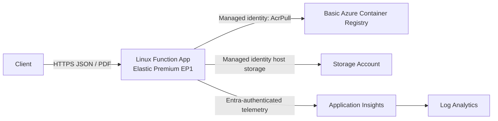

# Puppeteer PDF on Azure Functions Elastic Premium

This educational demo is an Azure Functions Node.js v4 app in a Linux custom container. It accepts structured invoice JSON, converts it to an accessible HTML document, renders that document with Puppeteer and system Chromium, and returns an A4 PDF.

The app deliberately does **not** accept arbitrary URLs or raw HTML. That keeps Chromium from becoming an open browser/proxy and makes escaping and validation manageable.

## What is included

- `POST /api/render-invoice` - validates invoice JSON and returns `application/pdf`.
- `GET /api/container-info` - returns Node, platform/architecture, and Chromium path/version only.
- Pure Node test coverage for validation, escaping, HTML semantics, totals, and filenames.
- A Functions Core Tools-generated Dockerfile adapted to install system Chromium.
- Bicep for a Basic ACR, Storage, Log Analytics, Application Insights, Linux EP1 plan, Function App, managed identity, and RBAC.
- PowerShell scripts for a local container smoke test and a later Azure deployment.

## Run the code locally

Prerequisites:

- Node.js 22 or 24
- Azure Functions Core Tools v4
- Chrome, Edge, or Chromium

Install the pinned dependencies:

```powershell
npm ci
```

If browser auto-discovery does not find your local browser, set its executable explicitly:

```powershell
$env:CHROMIUM_PATH = 'C:\Program Files\Google\Chrome\Application\chrome.exe'
```

Run the tests and Functions host:

```powershell
npm test
npm start
```

In another PowerShell window:

```powershell
Invoke-RestMethod http://localhost:7071/api/container-info

Invoke-WebRequest `
  -Uri http://localhost:7071/api/render-invoice `
  -Method Post `
  -ContentType application/json `
  -InFile .\samples\invoice.json `
  -OutFile .\invoice.pdf
```

Invalid payloads return HTTP 400 with field-level details. Bodies over 256 KiB return HTTP 413.

## Run the container locally

Build and run manually:

```powershell
docker build --tag puppeteer-invoice-functions:local .
docker run --rm --name puppeteer-invoice-demo --publish 8080:80 puppeteer-invoice-functions:local
```

Call the same endpoints on port 8080:

```powershell
Invoke-RestMethod http://localhost:8080/api/container-info

Invoke-WebRequest `
  -Uri http://localhost:8080/api/render-invoice `
  -Method Post `
  -ContentType application/json `
  -InFile .\samples\invoice.json `
  -OutFile .\invoice-container.pdf
```

Or run the repeatable smoke test. It builds the image, starts one uniquely named container, waits for the Functions host, checks Chromium, verifies a non-empty `%PDF-` response, and removes only that exact container:

```powershell
.\scripts\smoke-test.ps1
```

Use `-SkipBuild` to test an image already built:

```powershell
.\scripts\smoke-test.ps1 -ImageName puppeteer-invoice-functions:local -SkipBuild
```

## Test a deployed Function App end to end

Set the base URL to your deployed Function App:

```powershell
$baseUrl = 'https://<function-app-name>.azurewebsites.net'
```

Confirm that Node and Chromium are available:

```powershell
Invoke-RestMethod "$baseUrl/api/container-info" | ConvertTo-Json -Depth 4
```

Render the sample invoice:

```powershell
Invoke-WebRequest `
  -Uri "$baseUrl/api/render-invoice" `
  -Method Post `
  -ContentType 'application/json' `
  -InFile '.\samples\invoice.json' `
  -OutFile '.\azure-invoice.pdf'
```

Verify the PDF signature and open the document:

```powershell
$pdf = [IO.File]::ReadAllBytes('.\azure-invoice.pdf')
[pscustomobject]@{
  Bytes = $pdf.Length
  Signature = [Text.Encoding]::ASCII.GetString($pdf, 0, 5)
}

Invoke-Item '.\azure-invoice.pdf'
```

The signature must be `%PDF-`, and the file should be larger than 1,000 bytes. Check input validation separately:

```powershell
try {
  Invoke-RestMethod `
    -Uri "$baseUrl/api/render-invoice" `
    -Method Post `
    -ContentType 'application/json' `
    -Body '{"invoiceNumber":""}'
} catch {
  $_.ErrorDetails.Message
}
```

The invalid request should return HTTP 400 with field-level error details.

## Container concepts in this sample

| Term | Meaning here |
|------|--------------|
| **Image** | An immutable, layered package containing the Functions host base image, Chromium/fonts, Node dependencies, and app code. |
| **Container** | A running instance of the image with an isolated process/filesystem view. Containers are disposable. |
| **Registry** | A server that stores and distributes tagged images. Azure Container Registry (ACR) is used later. |
| **Host** | The machine/platform running the container: Docker Desktop locally or Azure Functions Elastic Premium in Azure. |

### Application dependencies versus OS dependencies

`package.json` and `package-lock.json` pin JavaScript dependencies such as `@azure/functions` and `puppeteer-core`. The Dockerfile installs OS packages such as Chromium and fonts with `apt-get`. npm cannot supply the Linux browser executable and apt cannot supply the Node API used to control it.

`puppeteer-core` is intentional: it does not download a second browser. `CHROMIUM_PATH=/usr/bin/chromium` points it to the browser installed by apt.

### Dockerfile layers

Each `RUN`, `COPY`, and `FROM` creates a cached layer. This Dockerfile:

1. Starts from the official Azure Functions Node 22 Linux image generated/recommended by Core Tools.
2. Installs Chromium and fonts in one layer, then removes apt metadata.
3. Copies package manifests and runs `npm ci --omit=dev` before app code, so dependency caching survives most code changes.
4. Copies only `host.json` and `src/` into the runtime image.

### Build, run, tag, push, and pull

```powershell
# Build a local image
docker build -t puppeteer-invoice-functions:v1 .

# Create a container and map host port 8080 to container port 80
docker run --rm -p 8080:80 puppeteer-invoice-functions:v1

# Add another name/tag that points to the same image
docker tag puppeteer-invoice-functions:v1 myregistry.azurecr.io/puppeteer-invoice-functions:v1

# Authenticate and push layers to a registry
az acr login --name myregistry
docker push myregistry.azurecr.io/puppeteer-invoice-functions:v1

# Pull those layers onto another host
docker pull myregistry.azurecr.io/puppeteer-invoice-functions:v1
```

The included Azure workflow prefers `az acr build`, which uploads the Docker build context and builds in ACR. Local Docker is then unnecessary for the cloud build.

### Ports and environment variables

The Functions base image listens on port 80. `-p 8080:80` maps local host port 8080 to it. Azure routes HTTPS traffic to the container without exposing Docker commands.

Environment variables configure a running image without changing it. This image sets non-secret browser/runtime values in the Dockerfile. Azure app settings configure Functions storage and Application Insights. Never bake secrets into an image or commit them in source.

### Immutability and statelessness

Treat an image tag as immutable: publish a new tag for each release instead of overwriting a deployed tag. A container's writable filesystem is temporary and differs per scaled-out instance, so this function returns the PDF directly and stores no invoice or browser state locally.

### Logs and scaling

Write logs to stdout/stderr; the Functions host and Application Insights collect them. Do not depend on local log files.

Elastic Premium keeps at least one warm EP1 worker and can add instances as HTTP load grows. Each instance starts its own containers and Chromium processes. Browser launches consume memory and CPU, so load-test before raising the scale limit or request concurrency.

### Image security

- Rebuild regularly to pick up monthly Azure Functions base-image and Debian security updates.
- Keep ACR admin credentials disabled and use managed identity with the narrow `AcrPull` role.
- Use `npm audit`, pin dependencies with the lockfile, and scan the final image in your registry/security tooling.
- Install only needed OS packages, clear apt metadata, exclude development files, and never include `local.settings.json`.
- Chromium receives only generated, escaped local HTML. It never navigates to user-supplied URLs.

## Azure architecture



- **ACR** stores the private image.
- The **Function App** runs that image on a Linux **Elastic Premium EP1 plan**.
- A system-assigned **managed identity** pulls from ACR through `AcrPull`; there is no registry password.
- **Storage** is required by the Functions runtime. The template uses identity-based host storage and disables shared keys.
- **Application Insights** sends telemetry to **Log Analytics**. Local ingestion auth is disabled, and the Function identity receives `Monitoring Metrics Publisher`.

The Bicep targets an **already-created resource group** and creates resources only inside it. Names and image tags are parameters; globally unique ACR, Storage, and Function App names include a deterministic suffix.

## Prepare for deployment later

Nothing in this repository automatically deploys resources. Review cost, region availability, quota, policy, naming, and RBAC first. EP1 has a continuously allocated minimum instance and therefore ongoing cost.

You need:

- Azure CLI authenticated to the intended subscription.
- An existing resource group.
- Permission to create the listed resources.
- `Microsoft.Authorization/roleAssignments/write` permission, commonly through User Access Administrator or Owner, for the generated role assignments.

Validate the template without deploying:

```powershell
az bicep build --file .\infra\main.bicep

az deployment group validate `
  --resource-group <existing-resource-group> `
  --template-file .\infra\main.bicep `
  --parameters namePrefix=pdfdemo imageTag=v1
```

Deploy infrastructure, build in ACR, update the image, and verify both endpoints:

```powershell
.\scripts\deploy.ps1 `
  -ResourceGroupName <existing-resource-group> `
  -NamePrefix pdfdemo `
  -Location eastus2 `
  -ImageTag v1
```

The script performs these operations:

1. `az deployment group create` creates infrastructure in the existing resource group.
2. `az acr build` performs the Docker build in Azure and pushes the tagged image.
3. `az functionapp config container set` points the Function App to that image.
4. The Function App restarts, then the script checks `container-info` and validates a PDF from `render-invoice`.

It does not hard-code subscription IDs or credentials. The currently selected Azure CLI subscription is used.

## Updating a release

Use a new immutable tag:

```powershell
.\scripts\deploy.ps1 `
  -ResourceGroupName <existing-resource-group> `
  -NamePrefix pdfdemo `
  -ImageTag v2
```

For troubleshooting, stream platform logs without entering the container:

```powershell
az webapp log tail `
  --resource-group <existing-resource-group> `
  --name <function-app-name>
```
